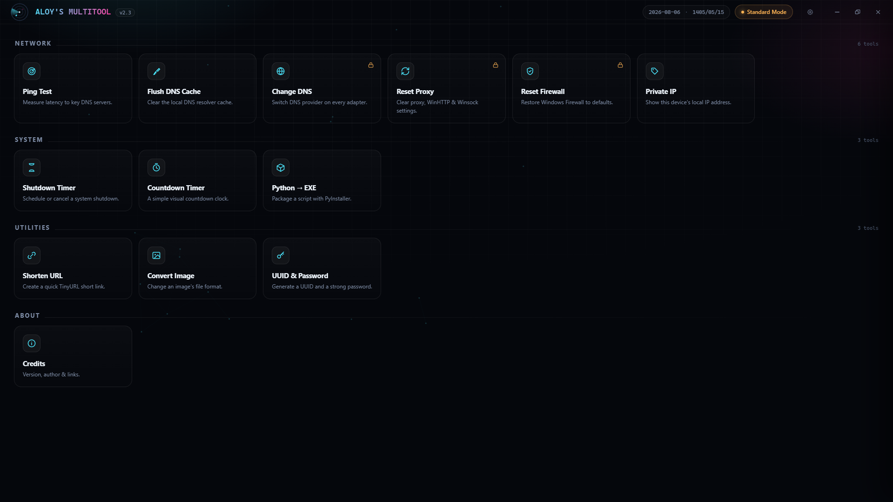

# Aloy's Multitool ⚙️

**A lightweight, offline Swiss Army knife for Windows.**

Aloy's Multitool is a standalone desktop utility that bundles essential network, system, and productivity tools into one sleek interface. No installation required—just run the `.exe` and go.

> **Note:** This is a closed-source project. All rights are reserved.

---

## 🚀 Features

### 🌐 Network Tools
- **Ping Test:** Measure latency to key DNS servers.
- **Flush DNS Cache:** Clear the local DNS resolver cache.
- **Change DNS:** Switch DNS provider on every adapter.
- **Reset Proxy:** Clear proxy, WinHTTP, and Winsock settings.
- **Reset Firewall:** Restore Windows Firewall to defaults.
- **Private IP:** Show this device's local IP address.

### 🖥️ System Tools
- **Shutdown Timer:** Schedule or cancel a system shutdown.
- **Countdown Timer:** A simple visual countdown clock.
- **Python → EXE:** Package a Python script into an executable using PyInstaller.

### 🛠️ Utilities
- **Shorten URL:** Create a quick TinyURL short link.
- **Convert Image:** Change an image's file format.
- **UUID & Password:** Generate a UUID and a strong password.

### 🎨 Personalization & System
- **System Tray:** Minimize to tray or launch straight into the tray on startup.
- **Startup Integration:** Option to launch automatically when Windows signs in.
- **Performance Mode:** Toggle "Reduce animations" to lower resource usage on slower machines.
- **7 Accent Themes:** Switch between Cyan Radar, Magenta Pulse, Emerald Signal, Amber Grid, Violet Static, Crimson Sweep, and Mono Steel.

---

## 💻 Installation (Portable)

Aloy's Multitool is fully portable. No installation is required.

1. Download the latest `.zip` from the **[Releases page](https://github.com/actually-aloy/aloy-multitool/releases)** (the zip name will change based on the version).
2. Extract the zip file to any folder on your PC.
3. Run `AMT.exe` to launch the app.

*(Note: Preferences and settings are saved automatically and restored the next time you launch the app.)*

---

## 📸 Screenshot

  

---

## 📞 Contact

Got questions or feedback? Hit me up on Telegram: [@actually_aloy](https://t.me/actually_aloy)

---

 

# 📖 فارسی (Persian)

## 🚀 درباره برنامه

**Aloy's Multitool** یک نرم‌افزار دسکتاپ سبک و آفلاین برای ویندوز است که ابزارهای ضروری شبکه، سیستم و بهره‌وری را در یک رابط کاربری زیبا جمع‌آوری کرده است. نیازی به نصب ندارد—فقط فایل `.exe` را اجرا کنید.

> **نکته:** این پروژه متن‌باز نیست و کلیه حقوق آن محفوظ است.

---

## ✨ امکانات

### 🌐 ابزارهای شبکه
- **Ping Test:** اندازه‌گیری تاخیر (Latency) به سرورهای DNS کلیدی.
- **Flush DNS Cache:** پاک‌سازی کش رزولور DNS محلی.
- **Change DNS:** تغییر ارائه‌دهنده DNS روی تمام آداپتورهای شبکه.
- **Reset Proxy:** پاک‌سازی تنظیمات پروکسی، WinHTTP و Winsock.
- **Reset Firewall:** بازگردانی فایروال ویندوز به تنظیمات پیش‌فرض.
- **Private IP:** نمایش آدرس IP محلی این دستگاه.

### 🖥️ ابزارهای سیستم
- **Shutdown Timer:** برنامه‌ریزی یا لغو خاموش‌ شدن سیستم.
- **Countdown Timer:** یک تایمر شمارش معکوس بصری ساده.
- **Python → EXE:** تبدیل یک اسکریپت پایتون به فایل اجرایی با استفاده از PyInstaller.

### 🛠️ ابزارهای کاربردی
- **Shorten URL:** ایجاد لینک کوتاه با TinyURL.
- **Convert Image:** تغییر فرمت فایل یک تصویر.
- **UUID & Password:** تولید یک UUID و یک رمز عبور قوی.

### 🎨 شخصی‌سازی و سیستم
- **System Tray:** قابلیت کوچک شدن به سینی سیستم و یا اجرای مستقیم در سینی سیستم هنگام روشن شدن.
- **Startup Integration:** گزینه‌ای برای اجرای خودکار برنامه هنگام ورود به ویندوز.
- **حالت عملکرد:** فعال‌سازی "Reduce animations" برای کاهش مصرف منابع در سیستم‌های کندتر.
- **۷ تم رنگی:** انتخاب بین Cyan Radar, Magenta Pulse, Emerald Signal, Amber Grid, Violet Static, Crimson Sweep و Mono Steel.

---

## 💻 نصب (پرتابل / نیازی به نصب نیست)

Aloy's Multitool کاملاً پرتابل است و نیازی به نصب ندارد.

۱. آخرین فایل `.zip` را از صفحه **[Releases](https://github.com/actually-aloy/aloy-multitool/releases)** دانلود کنید (نام فایل زیپ بر اساس نسخه تغییر می‌کند).
۲. فایل زیپ را در هر پوشه‌ای روی سیستم خود از حالت فشرده خارج کنید.
۳. فایل `AMT.exe` را اجرا کنید تا برنامه باز شود.

*(نکته: تنظیمات و اولویت‌ها به صورت خودکار ذخیره شده و در دفعه بعدی که برنامه را اجرا کنید، بازیابی می‌شوند.)*

---

## 📸 تصویر

  

---

## 📞 ارتباط با من

سوال یا پیشنهادی دارید؟ تلگرام: [@actually_aloy](https://t.me/actually_aloy)
